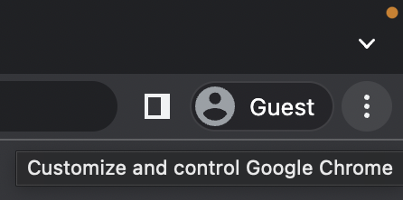
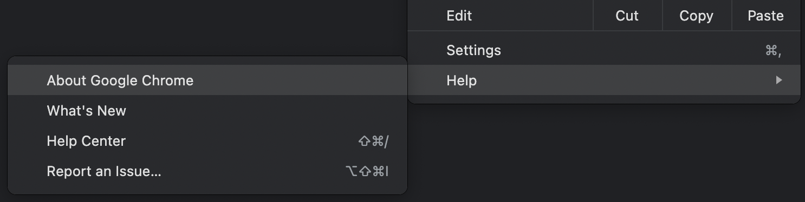
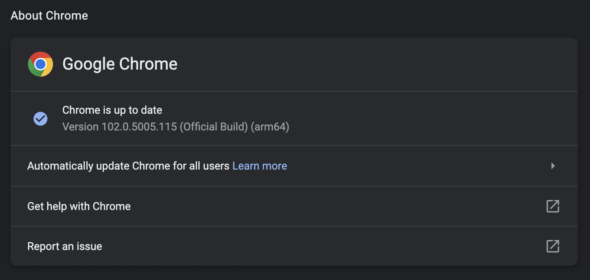

# URL Scrub

Tool for parsing URL webpage into JSON + RDF.

## Setup

### Dependencies

- Python: [`3.10`](https://www.python.org/downloads/)
- [`geckodriver`](https://github.com/mozilla/geckodriver/releases) or [`chromedriver`](https://chromedriver.chromium.org/downloads)

### Installation Process

1. Install `urlscrub` with `pip`

    ```bash
    python3.10 -m pip install urlscrub
    ```
  
2. Install `geckodriver`
   - [Download Firefox](https://www.mozilla.org/en-US/firefox/new/) and install.
     - Linux (Ubuntu):

        ```bash
        sudo apt-get install firefox
        ```

   - [Download `geckodriver.zip`](https://github.com/mozilla/geckodriver/releases).
   - Unzip `geckodriver`/`geckodriver.exe` file into a preferred directory.
   - Append the directory containing `geckodriver` to your `PATH` variable. ([Guide](#guide__append_path))

3. Install `chromedriver`
   - [Download Google Chrome](https://www.google.com/chrome/) and install.
   - Find the version of Google Chrome you have installed.
     - Open Google Chrome web browser.
     - Click on 3 vertical dots at top right. ([Picture](docs/images/chrome_version__1.png))

        <!--  -->

     - At the bottom of the dropdown, select `Help`, then `About Google Chrome`. ([Picture](docs/images/chrome_version__2.png))

        <!--  -->

     - Remember the version number displayed ([Picture](docs/images/chrome_version__3.png); Ex: `102.0.5005.115`)

        <!--  -->

   - [Download `chromedriver.zip`](https://chromedriver.chromium.org/downloads) with the most corresponding version number.
     - Exact version number not required (Ex: chromedriver `102.0.5005.61` w/ Google Chrome `102.0.5005.115`)
   - Unzip `chromedriver`/`chromedriver.exe` file into a preferred directory.
   - Append the directory containing `chromedriver` to your `PATH` variable. ([Guide](#guide__append_path))

## Command Line Usage

- Command:

  ```bash
  urlscrub --skip-cookies --driver "chrome" -l "https://www.amazon.com/All-new-Kindle-Oasis-now-with-adjustable-warm-light/dp/B07GRSK3HC"
  ```

- Response:

  ```json
  {
    "results": [
      {
        "type": "product",
        "productTitle": "Kindle Oasis \u2013 With adjustable warm light",
        "availability": "In Stock.",
        "rating": "19,734 ratings",
        "imageURL": "https://m.media-amazon.com/images/I/614TlIaYBvL._AC_SX679_.jpg"
      }
    ]
  }
  ```

## Guides

- <a id='guide__append_path'></a> Appending directories to your `PATH` environment variable.
  - **[Windows Guide](https://www.computerhope.com/issues/ch000549.htm)**
  - **Linux**:
    - Append path to your `.bashrc`/`.zshrc`

      ```bash
      export PATH="<geckodriver_dir>/:$PATH"
      ```

- [Guide to install VcXsrv for running Firefox on WSL2](https://www.youtube.com/watch?v=4SZXbl9KVsw)